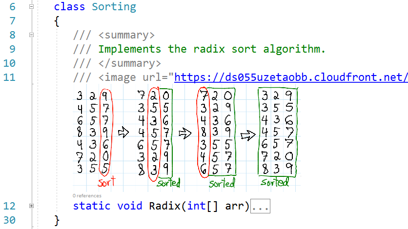

# Memeful Comments
Enables displaying images, including animated GIFs, throughout source code from an &lt;image> tag.

This Visual Studio extension enables displaying images, including animated GIFs, alongside your code to enhance explanations with visuals or simply to express your reaction to the code. You can easily show your co-workers, with only a comment line, how you facepalmed yourself when you saw what they checked in recently.

The supported languages are C#, C, C++, F#, VB.NET, JavaScript, TypeScript, and Python.

All versions and editions of Visual Studio 2017 and 2019 are supported.

To display an image, either from the web or your local disk, include a <image> tag in the source code comments. Use the url or src attribute to specify its location and optionally scale to indicate a scaling factor.
  
**Example**

```
class Sorting
{
   /// <summary>
   /// Implements the radix sort algorithm.
   /// </summary>
   /// <image url="https://ds055uzetaobb.cloudfront.net/image_optimizer/22630368cbc032ea43967b2610e73ded399e22a4.png" scale="0.5" />
   static void Radix(int[] arr)
   {
   }
}
```
**Result**


## Installation
Download or clone the repository and double-click/activate the MemefulComments.vsix file in Explorer.

Alternatively, you can install it from the [Visual Studio Marketplace](https://marketplace.visualstudio.com/items?itemName=MariusBancila.memefulcomments).

## How to use it
To display images, including animated ones, in your source code in any of the supported languages, you have to add an `<image>` tag. The following attributes are supported:

| Attribute  | Required | Description | 
| ------------- | ------------- |------------- |
| `url` or `src`  | Yes  | Represents the source of the image. It can be either from a local disk or from web. If the file is from the local disk it can be either absolute or relative to the document path. |
| `scale`  | No  | Indicates a scaling factor for the image. Notice that a very large scale might make the image impossible to display. Invariant culture is used for parsing the value, therefore always use dot for the decimal point.|

### Environment variables
Visual Studio environment variables `$(SolutionDir)` and `$(ProjectDir)` can be used in URLs.

**Example**

```
class Sorting
{
   // <image url="$(ProjectDir)Images\radix.png" scale="0.5" />
   static void Radix(int[] arr)
   {
   }
}
```

## Credits
This extension is based on the [image-comments](https://github.com/lukesdm/image-comments) extensions by [Luke McQuade](https://github.com/lukesdm).
